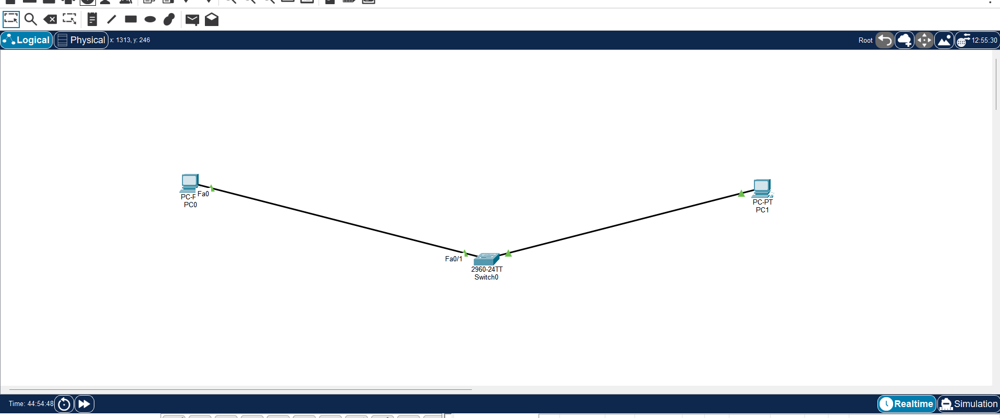
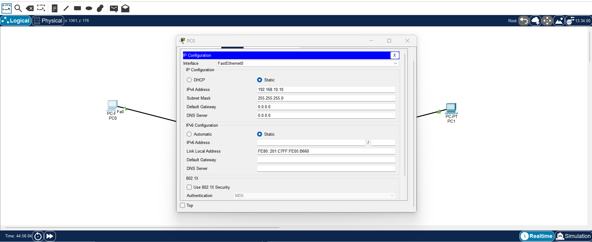
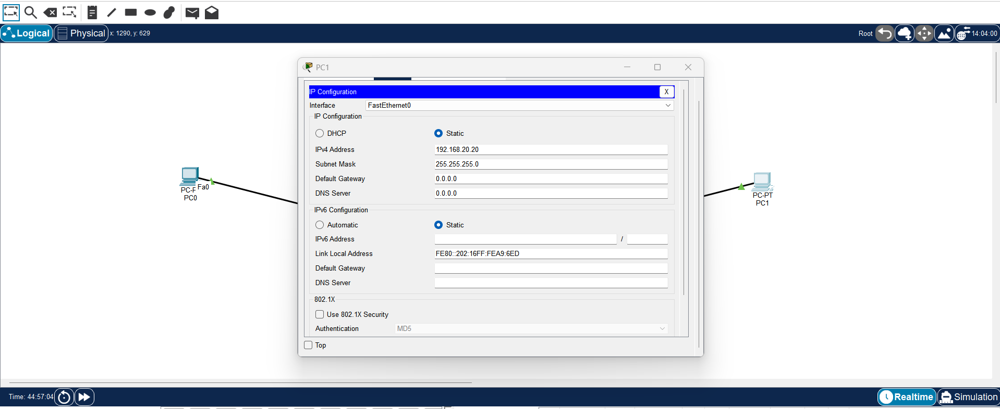
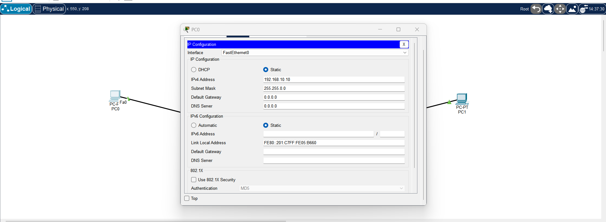
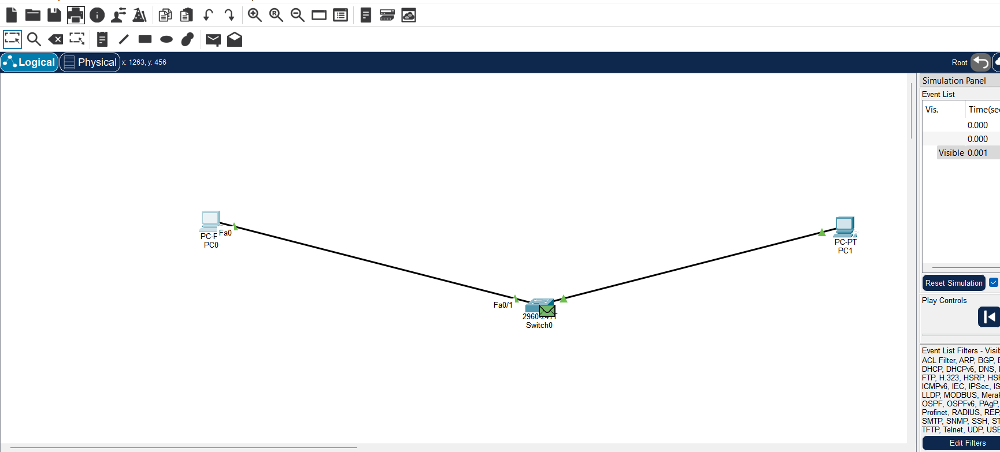
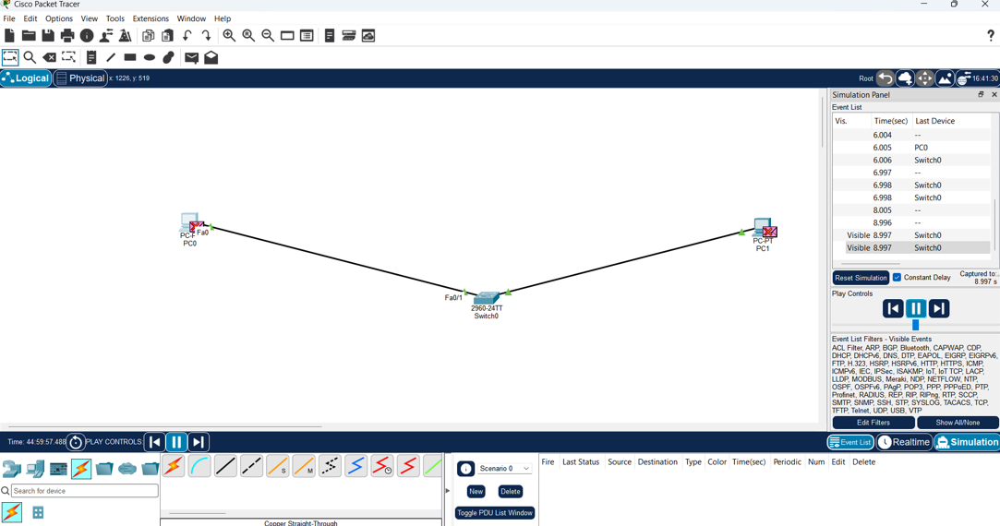
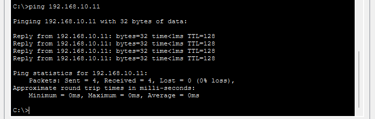

# Subnet-Mismatch-and-ARP-Failure
## Aim

To understand how a subnet mismatch affects communication between two PCs and observe ARP resolution failure using Cisco Packet Tracer Simulation Mode.

## Network Topology

PC0 and PC1 are connected through a Cisco 2960 switch.



## Initial Configuration

### PC0 Configuration

* IP Address: `192.168.10.10`
* Subnet Mask: `255.255.255.0`



### PC1 Incorrect Configuration

PC1 is deliberately configured on a different subnet.

* IP Address: `192.168.20.20`
* Subnet Mask: `255.255.255.0`



## Creating the ARP Failure

To make PC0 treat PC1 as a local host, the subnet mask of PC0 is temporarily changed to:

* IP Address: `192.168.10.10`
* Subnet Mask: `255.255.0.0`



## Simulation

Simulation Mode is enabled and only ARP and ICMP protocols are selected.

A ping is sent from PC0 to:

```text
ping 192.168.20.20
```

PC0 generates an ARP request to find the MAC address of PC1.



## Packet Drop

The ARP request reaches PC1, but no valid ARP reply is generated because the addressing configuration is inconsistent.

The packet is therefore dropped.



## Correcting the Configuration

PC1 is changed to the same subnet as PC0:

* IP Address: `192.168.10.11`
* Subnet Mask: `255.255.255.0`

PC0 is also restored to:

* IP Address: `192.168.10.10`
* Subnet Mask: `255.255.255.0`

## Verification

The connection is tested again from PC0 using:

```text
ping 192.168.10.11
```

The ping is successful and replies are received from PC1.



## Result

The subnet mismatch and ARP resolution failure were successfully observed in Cisco Packet Tracer. After configuring both PCs in the same subnet, communication was restored and the ping was successful.
